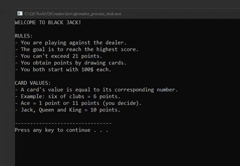

## Description 
- The Blackjack casino banking game created with C++.
- This project was a compulsory assignment for the course "Programming 1" at "Inland Norway University of Applied Sciences".

## Technical Data
- Author: Eivind Hobrad Naasen
- Date: September 28th, 2019
- IDE: QtCreator 4.9.2
- Language: C++11

## Preview

